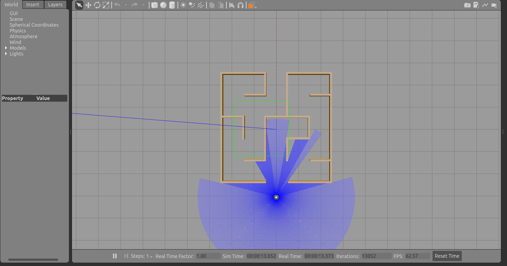

# Kratos Maze
This is a starter repository for Project Kratos' Maze Solving Challenge as part of the 2025 Autonomous subsystem induction process.

## Prerequisites
- [Ubuntu 22.04](https://releases.ubuntu.com/jammy/) or equivalent VM
- [ROS 2 Humble](https://docs.ros.org/en/humble/index.html)
- [TurtleBot3](https://emanual.robotis.com/docs/en/platform/turtlebot3/simulation/#gazebo-simulation)

## Installation

### Clone the Package

Forking the repo first is suggested, so that you can maintain your own repo and push changes to it. This will also be helpful for submission. After forking the repo,

```bash
# fork the repo before running this
cd ros2_ws/src
git clone https://github.com/<your_username>/kratos_maze.git
```

### Build the Package

```bash
cd .. # build in the root of your workspace i.e. ros2_ws/
colcon build --packages-select kratos_maze
source install/setup.bash
```
To be safe, build the package and source everytime you make a change. Or, `--symlink-install` might be of interest, take a look at the [docs](https://docs.ros.org/en/humble/Tutorials/Beginner-Client-Libraries/Colcon-Tutorial.html).

## How to Run
There are two orthogonal simple mazes provided to you with no loops, obstacles etc.

<p align="center">
  
  &nbsp;&nbsp;&nbsp;&nbsp;
  <br>
  <em>10x10 Maze &nbsp;&nbsp;&nbsp;&nbsp;&nbsp;&nbsp;&nbsp;&nbsp;&nbsp;&nbsp;&nbsp;&nbsp;&nbsp;&nbsp;&nbsp;&nbsp;&nbsp;&nbsp;&nbsp;&nbsp;&nbsp;&nbsp;&nbsp;&nbsp;&nbsp;&nbsp;&nbsp;&nbsp;&nbsp;&nbsp;&nbsp;&nbsp; 5x5 Maze</em>
</p>

### Launch the Maze Environment

```bash
ros2 launch kratos_maze maze5x5.launch.py   # for the 5x5 maze
ros2 launch kratos_maze maze10x10.launch.py # for the 10x10 maze
```

You should see the Gazebo environment.

<p align="center">
  <br>
  <em>Gazebo Maze Environment</em>
</p>

> [!NOTE]
> In case it doesn't work, remove the `kratos_maze` folder from `build/`, `install/` and `src/`, and follow all the steps once again, it should work now. (you could possibly get a warning while building, ignore it)

### Run a Script
There is a sample wall following algorithm script (based on [this](https://www.youtube.com/watch?v=1l9IMXd33K4&ab_channel=HeyYK)) provided to you. This takes ~17 mins to solve the given 10x10 maze! ([watch](https://youtu.be/DYmenPxvgQ0?si=1aZUr6M8rGNV7lew))

Run this in another terminal. You might want to use [terminator](https://gnome-terminator.org/) emulator for multiple terminals in one window. Make sure you source in every terminal window.

```bash
ros2 run kratos_maze wall_follower
```

Nice! Now, you should see the bot starting to solve the maze.

To create your own script, add it in the `src/` directory and make sure to update the `setup.py` file with your node.

> [!TIP]
> For VS Code users, to resolve the import errors (yellow squiggles) create a `.env` file in the root of your workspace and add `PYTHONPATH=/opt/ros/humble/lib/python3.10/site-packages` in it.


## What's the Challenge?

Solve the given 10x10 maze in the fastest time possible!

### Some Rules
1. The bot must navigate from the designated start point to finish point in the shortest time without any external intervention. No tricks allowed, for example, you can't use the outer boundary of the maze xD.

2. The timer starts as soon as you run your final script. This does not include the time taken for any utility scripts you decide to use :).

3. You would be required to submit your code, along with a video of the bot solving the maze, so make sure you record the process.

## Submission

Link to your fork of the repo (your updated package), along with a video. [Google Form](forms.gle/qQ5oTvFYuaY6yCvq9).

<hr></hr>

Join the [Discord](https://discord.gg//WWW7muQA) server for regular updates. Have fun!